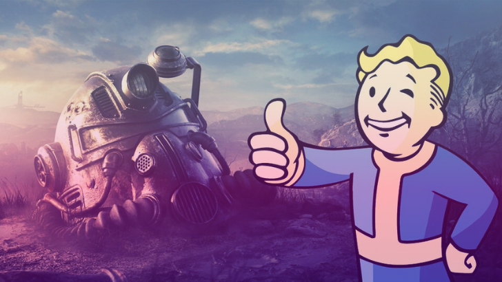
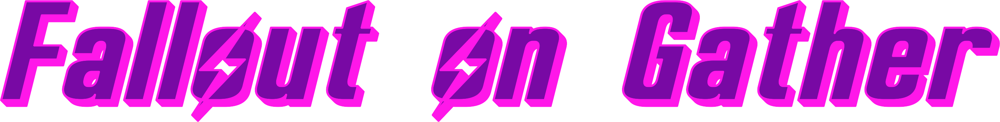
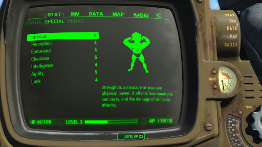
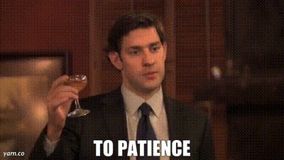
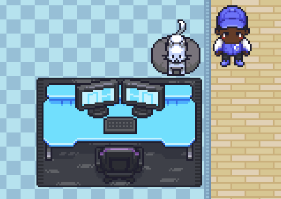

  

    

Let's gather together

    

## 📚 Content

- [Starter pack](#starter)
- [How to](#how_to)
- [Tools](#tools)
- [Library](#library)

## 🎒 Starter pack

<table>
    <tbody>
        <tr>
            <td style="border: none">
                
            </td>
            <td style="border: 1px solid #7809A4; padding: 20px">
                Nothing needed, feel free to fork this repo if you wnant to have all the assets on you computer and don't hesitate to contribute to this repository with your own creations 
                <blockquote style="background-color: transparent; border-left: 6px solid #ff4757; font-style: italic; margin-top: 20px">
                
Side note:
 
All the assets present in this repository (even the custo ones) are made so they can fit the Gather design requirements 

                </blockquote>
            </td>
        </tr>
    </tbody>
<table>

For the busy ones

  

  ##### 1. Copy paste the derired item directly on the map with copy pasting it 
  
  ##### OR 

  ##### 2. Download any image you want on the `/src` folder. 

The folder follows this structure:

    ├── src                     # Main diretory
    │   ├── [assets](./src/assets) # Assets used to build the Readme
    │   ├── gather-discord      # Any fun asset found the Gather's discord
    │   ├── gather-repo         # Miscellaneous information
    │   ├── sunday-2-gather       # Getting started guide

  ##### 3. Follow the instructions about uploading of a custom pet/kart. 

<blockquote style="background-color: transparent; border-left: 6px solid #ff4757; margin-top: 20px">

Side note:

- [Add a custom pet on Gather](https://support.gather.town/hc/en-us/articles/15910378855316-Add-Dogs-and-Custom-Pets)
- [Add a custom kart on Gather](https://support.gather.town/hc/en-us/articles/15910378922388-Go-Karts)
- [Add a custom object on Gather](https://support.gather.town/hc/en-us/articles/15909788073236-Custom-Objects)
</blockquote>

For the patient ones

  

  ##### 1. Copy Paste the derired item directly on the map with copy pasting it 

## 🤔 How to ?!

🪛This section is truly about the fun that can be done on Gather with few tricks !

#### Items Customization

<blockquote style="background-color: transparent; border-left: 6px solid #ff4757; font-style: italic; margin-top: 20px; margin-bottom: 3em">

Side note:
 
You can download here the oeverall design guideline made by the Gather team

[👉 Check out their public map making repository](#library)

</blockquote>

   

   
🐰 Any pet you want !

   
   [ x ] Requirements

  <table align="center">
    <tbody>
      <tr>
        <td>
          Element
        </td>
        <td>
          Specifications
        </td>
      </tr>
      <tr>
        <td>
          Grid (px)
        </td>
        <td>
          128x160
        </td>
      </tr>
      <tr>
        <td>
          Frames (n°)
        </td>
        <td>
          16
        </td>
      </tr>
      <tr>
        <td>
          Format
        </td>
        <td>
          .png
        </td>
      </tr>
            <tr>
        <td>
          Custom sprite sheet: 
        </td>
        <td>
          5 rows with 4 frames per row: idle, walk east, walk south, walk west, walk north
        </td>
      </tr>
            <tr>
        <td>
          Custom normal image
        </td>
        <td>
          Sprite sheet (or single image) for when the pet is not actively following anyone. If you do not upload a custom normal image, the idle sprites from the Custom sprite sheet are used
        </td>
      </tr>
    </tbody>
  <table>       

   

   

    
🚗 Kart and Furious
   
     <table>
    <tbody>
      <tr>
        <td>
          Element
        </td>
        <td>
          Specifications
        </td>
      </tr>
      <tr>
        <td>
          Grid (px)
        </td>
        <td>
          512x32
        </td>
      </tr>
      <tr>
        <td>
           Frames (n°)
        </td>
        <td>
          16
        </td>
      </tr>
    </tbody>
  <table>       
    

## 🧰 Tools

⚓The tools usded for mainly editing the different sprites sheets so they can fit the Gather space requirements are all below 👇

➡️ [Remove.bg](https://github.com/fraction/readme-boilerplate/issues/new): remove any background to make your image's background transparent without loosing resolution

➡️ [Photopea](https://www.photopea.com/): a free online editor

➡️ [I love img](https://www.iloveimg.com/crop-image): Really cool website of a large variety in functionnalities to convert, optimize, crop any image (not pretty food on removing backgrudn though!)

## 📜 Library

🔖Here, you can find all the essentials that made this Readme page possible 👇

➡️ [Gather mapmaking repo](https://github.com/gathertown/mapmaking/tree/master)
➡️ [Font Generator](https://fontmeme.com/fallout-font/)
➡️ [Palette Color](https://flatuicolors.com/)
➡️ [Emojis](https://emojipedia.org/smileys)
➡️ [Hex to RGB Converter](https://www.rapidtables.com/convert/color/hex-to-rgb.html)

