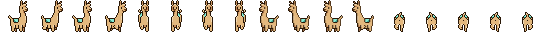

<div style="background-color: rgba(217, 128, 250, 0.2)">
<div style="margin-top: 2em"></div>


<p>
  
</p>

<p align="center" style="z-index: 1200">
    
</p>

<div style="padding: 50px; margin-top: -3.5em">

<p align="center" style="color: purple; font-weight: 800; font-size: 26px; font-style: italic; margin-bottom: 1em">Let's gather together</p>

[]()
   [](https://www.youtube.com/watch?v=dQw4w9WgXcQ&pp=ygUXbmV2ZXIgZ29ubmEgZ2l2ZSB5b3UgdXA%3D) [](https://www.youtube.com/watch?v=dQw4w9WgXcQ&pp=ygUXbmV2ZXIgZ29ubmEgZ2l2ZSB5b3UgdXA%3D)


<div with="100%" style="border: 1px dashed purple; margin: 4em"></div>


# 📚 Content

- #### [Starter pack](#starter-pack)
- #### [How to](#how-to)
- #### [Tools](#tools)
- #### [Library](#library)


<div with="100%" style="border: 1px dashed purple; margin: 4em"></div>

# 🎒 Starter pack

<table style="margin-top: 4em; margin-bottom: 4em">
    <tbody>
        <tr>
            <td style="border: none">
                
            </td>
            <td style="border: 1px solid #7809A4; padding: 20px">
                Nothing needed, feel free to fork this repo if you wnant to have all the assets on you computer and don't hesitate to contribute to this repository with your own creations 
                <blockquote style="background-color: transparent; border-left: 6px solid #ff4757; font-style: italic; margin-top: 20px">
                <p style="margin-bottom: 2px; text-decoration: underline; color: #ff4757">Side note:</p> <p style="font-weight: bold">All the assets present in this repository (even the custo ones) are made so they can fit the Gather design requirements </p>
                </blockquote>
            </td>
        </tr>
    </tbody>
<table>

<div style="margin-top: 4em; margin-bottom: 3em"></div>
<details>
<summary>Je ne peux pas, j'ai piscine!</summary>
<p align="center" style="font-weight: bold; font-style: italic; margin-top: 4em">
For the busy ones
</p>
<p align="center">
  
</p>

  ###### 1. Copy paste the desired item directly on the map with copy pasting it 
  
  ###### OR 

  ###### 2. Download any image you want on the `/src` folder. 

The folder follows this structure:

    ├── src                           # Main diretory
    │   ├── [assets](./src/assets)    # Assets used to build the Readme
    │   ├── gather-discord            # Any fun asset found the Gather's discord
    │   ├── gather-repo               # Assets found on the gather repo
    │   ├── sunday-2-gather           # Custom assets home made

<p style="margin-top: 2em"></p>

  ###### 3. Follow the instructions about uploading of a custom pet/kart. 

<blockquote style="background-color: transparent; border-left: 6px solid #ff4757; margin-top: 20px">

<p style="margin-bottom: 2px; text-decoration: underline; color: #ff4757">Side note:</p>

- [Add a custom pet on Gather](https://support.gather.town/hc/en-us/articles/15910378855316-Add-Dogs-and-Custom-Pets)
- [Add a custom kart on Gather](https://support.gather.town/hc/en-us/articles/15910378922388-Go-Karts)
- [Add a custom object on Gather](https://support.gather.town/hc/en-us/articles/15909788073236-Custom-Objects)
</blockquote>
</details>

<details style="margin-top: 2em; margin-bottom: 2em" open>
<summary> Bring it on, I have time for this!</summary>
<p align="center" style="font-weight: bold; font-style: italic; margin-top: 40px">
For the patient ones
</p>

<p align="center">
  
</p>

  ###### 1. Follow the steps below to create your own Gather asset and/or go further with Gather playing around with their API/websocket 👇


<div with="100%" style="border: 1px dashed purple; margin: 4em"></div>


# 🤔 How to ?!

<p style="background-color: rgba(255, 107, 129, 0.2); border-radius: 20px; font-weight: bold; font-size: 14px; padding: 30px; position: relative"><span style="background-color: white; border: 5px solid rgba(255, 107, 129, 0.9); border-radius: 50%; padding: 10px; position: absolute; left: -15px; top: -0.7em">🪛</span>This section is truly about the fun that can be done on Gather with few tricks !</p>

<div with="100%" style="margin: 2em"></div>

## 🎨 Items Customization

<blockquote style="background-color: transparent; border-left: 6px solid #ff4757; font-style: italic; margin-top: 20px; margin-bottom: 3em">
  <p style="margin-bottom: 2px; text-decoration: underline; color: #ff4757">Side note:</p> <p style="font-weight: bold">You can download here the oeverall design guideline made by the Gather team

  👉 Check out their [public map making repository](#library)
  </p>
</blockquote>

<details>
  <summary>🐰 Any pet you want !</summary>
  <section style="margin-top: 1em">
    
  </section>
  <section style="display: flex; flex-direction: row; margin-top: 2em; align-content: center; justify-content: center">
    <section style="width: 70%; padding-right: 10px; border-right: 1px solid grey">
        <p style="font-weight: 700">
          Grid (px)
        </p style="font-weight: 700">
        <p style="font-weight: 700">
          Frames (n°)
        </p>
        <p style="font-weight: 700">
          Format
        </p>
        <p style="font-weight: 700">
          Custom sprite sheet: 
        </p>
        <p style="font-weight: 700">
          Custom normal image:
        </p>
        <p style="font-weight: 700">
          Order:
        </p>
      </section>
      <section style="margin-left: 50px">
        <p>
          128x160
        </p>
        <p>
          16
        </p>
        <p>
          .png
        </p>
        <p>
          5 rows with 4 frames per row
        </p>
        <p>
          Sprite sheet (or single image) for when the pet is not actively following anyone. If you do not upload a custom normal image, the idle sprites from the Custom sprite sheet are used
        </p>
        <p>
          Idle, Walk East, Walk South, Walk West, Walk North
        </p>
      </section>
      </section>
      <section>
        <blockquote style="background-color: transparent; border-left: 6px solid #ff4757; font-style: italic; margin-top: 20px; margin-bottom: 3em">
          <p style="margin-bottom: 2px; text-decoration: underline; color: #ff4757">Side note:</p> <p style="font-weight: bold">🚨 Be careful when creating your own spridesheet to make share you respect strictly the frame order, rows and direction. Otherwise, it won't work (see below 👇)
          </p>
          <section style="display: flex; flex-direction: column; margin-top: 1em; align-items: center">
            <p style="display: flex; flex-direction: column">
              <p><h5>Right Format</h5></p>
              <p></p>
              <p></p>
            </p>
            <p style="display: flex; flex-direction: column; margin: 0">
              <p><h5>Wrong Format</h5></p>
              <p style="margin: 0"></p>
            </p>
          </section>
        </blockquote>
      </section>
</details>

<details>
  <summary>🚗 Kart and Furious</summary>
  <section style="margin-top: 1em">
    
  </section>
  <section style="display: flex; flex-direction: row; margin-top: 2em">
      <section style="width: 70%; padding-right: 10px; border-right: 1px solid grey">
        <p style="font-weight: 700">
          Grid (px):
        </p style="font-weight: 700">
        <p style="font-weight: 700">
          Frames (n°):
        </p>
        <p style="font-weight: 700">
          Format:
        </p>
        <p style="font-weight: 700">
          Custom sprite sheet: 
        </p>
        <p style="font-weight: 700">
          Custom normal image:
        </p>
        <p style="font-weight: 700">Order:</p>
      </section>
      <sections style="margin-left: 50px">
        <p>
          32x32 per frame
        </p>
        <p>
          .png
        </p>
        <p>
          512x32
        </p>
        <p>
          5 rows with 4 frames per row: idle, walk east, walk south, walk west, walk north
        </p>
        <p>
          Sprite sheet (or single image) for when the pet is not actively following anyone. If you do not upload a custom normal image, the idle sprites from the Custom sprite sheet are used
        </p>
        <p>East, South, West, North</p>
      </section>
      <section>
        <blockquote style="background-color: transparent; border-left: 6px solid #ff4757; font-style: italic; margin-top: 20px; margin-bottom: 3em">
          <p style="margin-bottom: 2px; text-decoration: underline; color: #ff4757">Side note:</p> <p style="font-weight: bold">🚨 Be careful when creating your own spridesheet to make sure you respect strictly the frame order as well as the number of frames per row. Otherwise, it won't work (see below 👇)
          </p>
          <section style="display: flex; flex-direction: column; margin-top: 10px">
            <p style="display: flex; flex-direction: column; margin: 0">
              <h5 style="text-align: center">Right Format</h5>
              <p></p>
              <p></p>
            </p>
            <p style="display: flex; flex-direction: column">
              <h5 style="text-align: center">Wrong Format</h5>
              <p style="text-align: center"></p>
            </p>
          </section>
        </blockquote>
      </section>
</details>

<div with="100%" style="margin: 4em"></div>

## 🕹️ Gather & APIs

<p style="background-color: rgba(83, 82, 237, 0.2); border-radius: 20px; font-weight: bold; font-size: 14px; padding: 20px 40px; position: relative; margin-top: 3em; margin-bottom: 2em"><span style="background-color: white; border: 5px solid rgba(83, 82, 237, 0.9); border-radius: 50%; padding: 10px; position: absolute; left: -15px; top: -0.7em">👾</span>Here, you can find all you need to kick start on coding with Gather 👇</p>

### 🛜 Connexion API
 :one: Retrieve your API key [here](https://app.gather.town/apikeys)
 :two: Init the api connexion as below 👇

````
module.exports = {
	SPACE_ID: "oFz81x6whatever\\SpaceName", // note the \, NOT / as is in the URL
	API_KEY: "YOUR KEY HERE",
};`
````
  :three: Check out the API documentation [here](https://gathertown.notion.site/Gather-HTTP-API-3bbf6c59325f40aca7ef5ce14c677444)

<div with="100%" style="margin: 3em"></div>

### 🗃️ Websocket SDK (gather-town-client)

 :one: Check out the npm package page [here](https://www.npmjs.com/package/@gathertown/gather-game-client?activeTab=code)
 :two: Follow the previous steps to get your API key
 :three: Find the websocket documentation [here](http://gather-game-client-docs.s3-website-us-west-2.amazonaws.com/#md:setup)
 :four: Find [here](https://gathertown.notion.site/Gather-Websocket-API-bf2d5d4526db412590c3579c36141063) the websocket client notion
 :five: Follow these instructions for your first steps coding on Gather

<blockquote style="background-color: transparent; border-left: 6px solid #2ed573; font-style: italic; margin-top: 20px; margin-bottom: 3em">
  <p style="margin-bottom: 2px; text-decoration: underline; color: #2ed573">Tips:</p> 
  <p>
  <p>

  * Go to `node_modules/@gathertown/gather-game-common/src/events.proto` file on the gather client sdk you have add and check `ServerClientEvent` message
  </p>
  <p>

  * You might want to add this [vsc proto extension](https://marketplace.visualstudio.com/items?itemName=zxh404.vscode-proto3) for syntax highlight
  </p>
  <p>

  * If you come accross a game/engine method with a defined `targetId`, this method is an action that can directly apply to any player in the space
  </p>
  <p>

  * Check out the [Developer Gather Forum](https://forum.gather.town/c/developers/6) for any question you might be wondering
  </p>
</blockquote>

<div style="background-color: rgba(255, 107, 129, 0.1); border: 1px solid #ff6b81; border-radius: 20px; margin: 0 auto; padding: 1em">

### 🪄 Awesome repositories to get inspired

<p style="margin-top: 2em"></p>

✨ [The Forest](): Forest game animation
✨ [The Jukebox API](): Play music on Gather 

</div>
</details>
  
  <div with="100%" style="border: 1px dashed purple; margin: 5em"></div>

# 🧰 Tools

  <p style="background-color: rgba(123, 237, 159, 0.2); border-radius: 20px; font-weight: bold; font-size: 14px; padding: 30px; position: relative"><span style="background-color: white; border: 5px solid rgba(123, 237, 159, 0.7); border-radius: 50%; padding: 10px; position: absolute; left: -15px; top: -0.7em">⚓</span>The tools usded for mainly editing the different sprites sheets so they can fit the Gather space requirements are all below 👇</p>

➡️ [Remove.bg](https://github.com/fraction/readme-boilerplate/issues/new): remove any background to make your image's background transparent without loosing resolution

➡️ [Photopea](https://www.photopea.com/): a free online editor

➡️ [I love img](https://www.iloveimg.com/crop-image): Really cool website of a large variety in functionnalities to convert, optimize, crop any image (not pretty food on removing backgrudn though!)

➡️ [OpenDrive](https://www.opendrive.com): Awesome cloud file storage (free after creating an account, 5GB available), ideal for external assets (music, images, documents...) to use with the Gather API

➡️ [Tiled](https://www.mapeditor.org/): Amazing map building library for those of you experts on world building!


  <div with="100%" style="border: 1px dashed purple; margin: 4em"></div>


# 📜 Library

  <p style="background-color: rgba(255, 165, 2, 0.2); border-radius: 20px; font-weight: bold; font-size: 14px; padding: 20px 40px; position: relative"><span style="background-color: white; border: 5px solid rgba(255, 165, 2, 0.9); border-radius: 50%; padding: 10px; position: absolute; left: -15px; top: -0.7em">🔖</span>Here, you can find all the essentials that made this Readme page possible 👇</p>

  <p align="right">

  ➡️ [Gather mapmaking repo](https://github.com/gathertown/mapmaking/tree/master)
  ➡️ [Font Generator](https://fontmeme.com/fallout-font/)
  ➡️ [Palette Color](https://flatuicolors.com/)
  ➡️ [Emojis](https://emojipedia.org/smileys)
  ➡️ [Hex to RGB Converter](https://www.rapidtables.com/convert/color/hex-to-rgb.html)

  </p>

  </div>
</div>